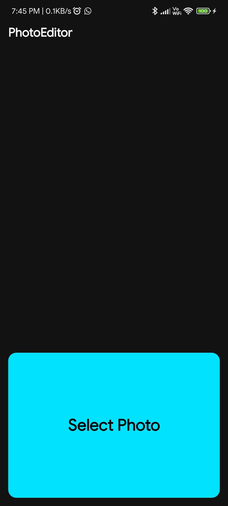
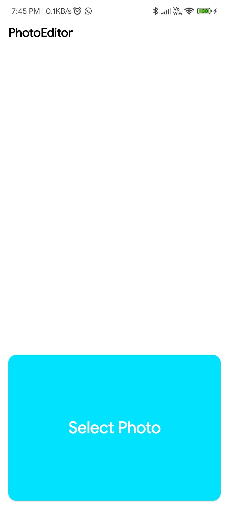
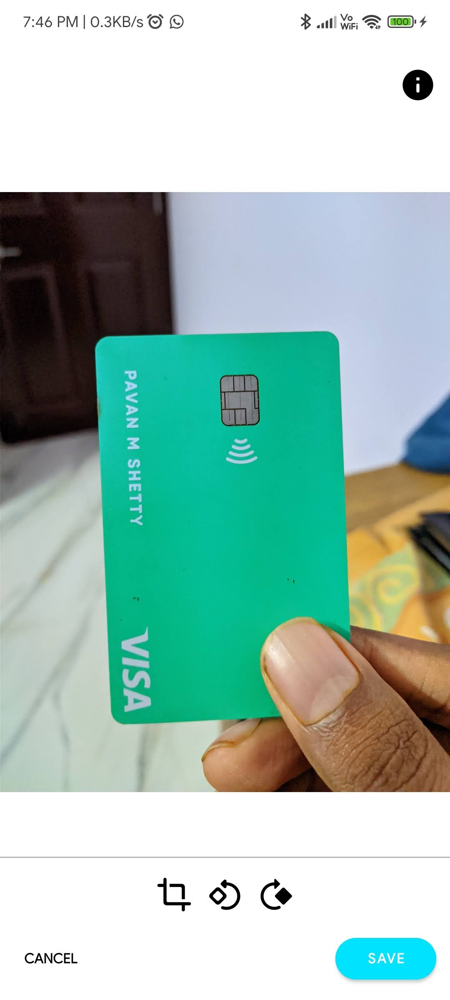
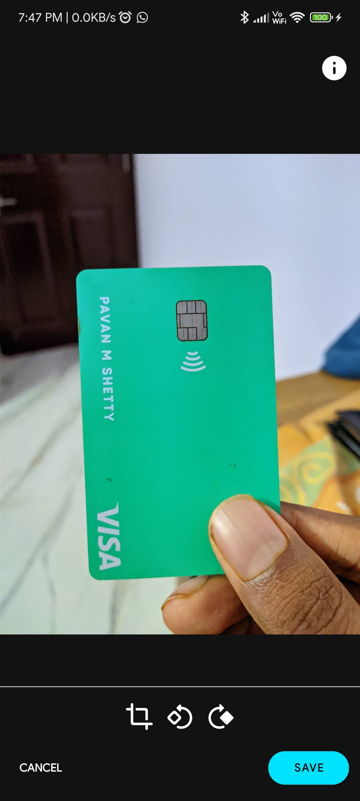
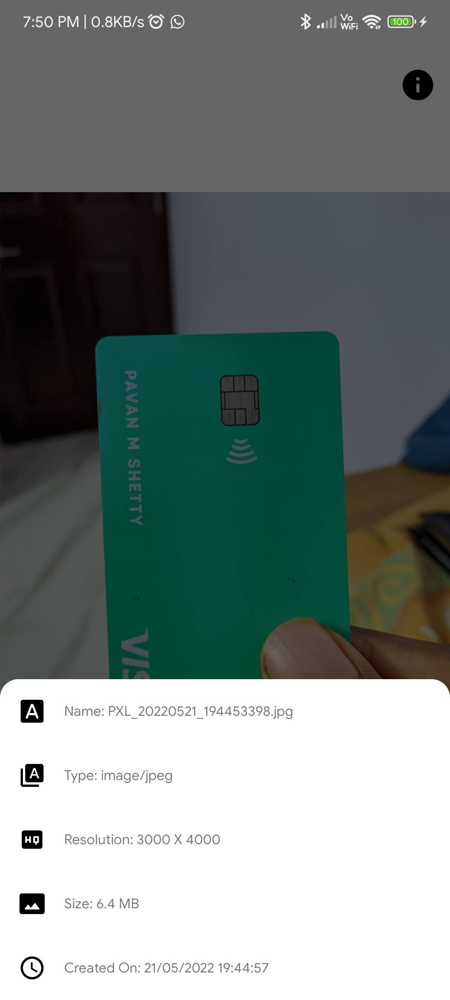
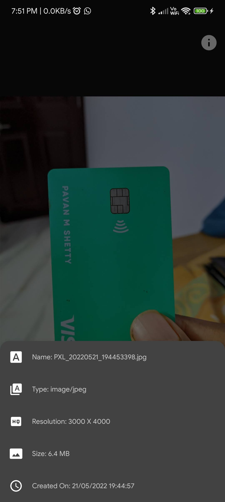
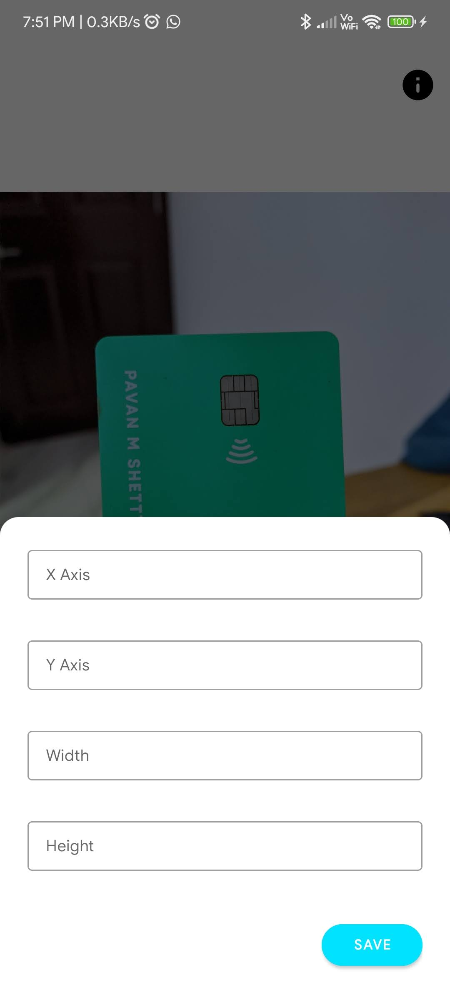
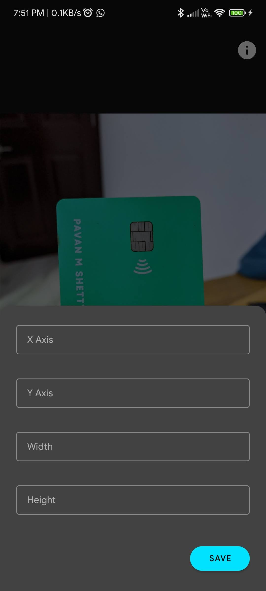
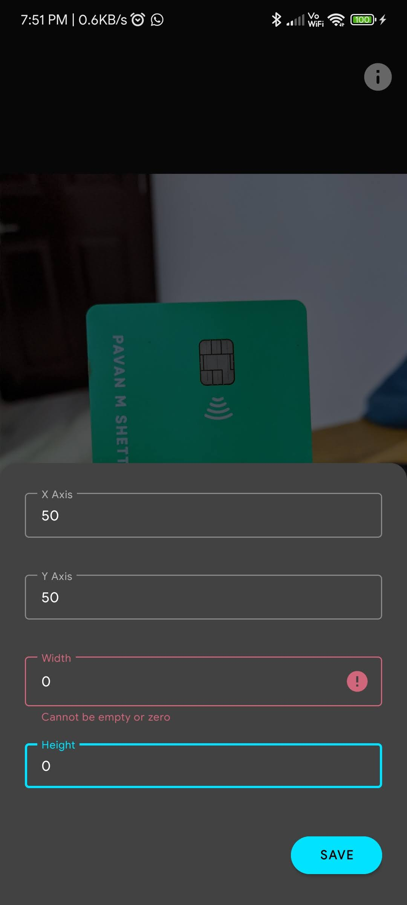

# PhotoEditor

Features
* Crop Photo
* Flip Photo
* See Photo information
* Save Photo
    
## 📸 Video

https://user-images.githubusercontent.com/24766565/169658271-1d9aed81-728b-4de6-adb1-a2bd6a6aa2c0.mp4

## 📸 Screenshots

||||
|:----------------------------------------:|:-----------------------------------------:|:-----------------------------------------: |
|  |  |  |
|  |  |     |
|  |  |  |

## Built With 🛠
- [Kotlin](https://kotlinlang.org/) - First class and official programming language for Android development.
- [Coroutines](https://kotlinlang.org/docs/reference/coroutines-overview.html) - For asynchronous and more..
- [Android Architecture Components](https://developer.android.com/topic/libraries/architecture) - Collection of libraries that help you design robust, testable, and maintainable apps.
  - [ViewBinding](https://developer.android.com/topic/libraries/view-binding) - Generates a binding class for each XML layout file present in that module and allows you to more easily write code that interacts with views.
- [Material Components for Android](https://github.com/material-components/material-components-android) - Modular and customizable Material Design UI components for Android.
- [Navigation Component](https://developer.android.com/guide/navigation) - Navigation refers to the interactions that allow users to navigate across, into, and back out from the different pieces of content within your app.

## Architecture
This app uses [***MVVM (Model View View-Model)***](https://developer.android.com/jetpack/docs/guide#recommended-app-arch) architecture.

Single Activity Architecture

## Contact 📩

 
